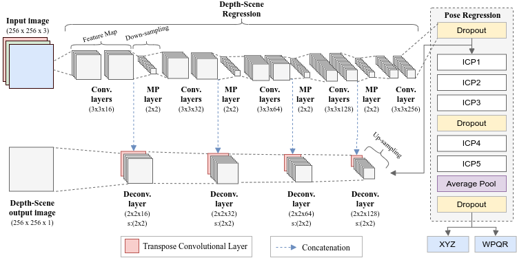
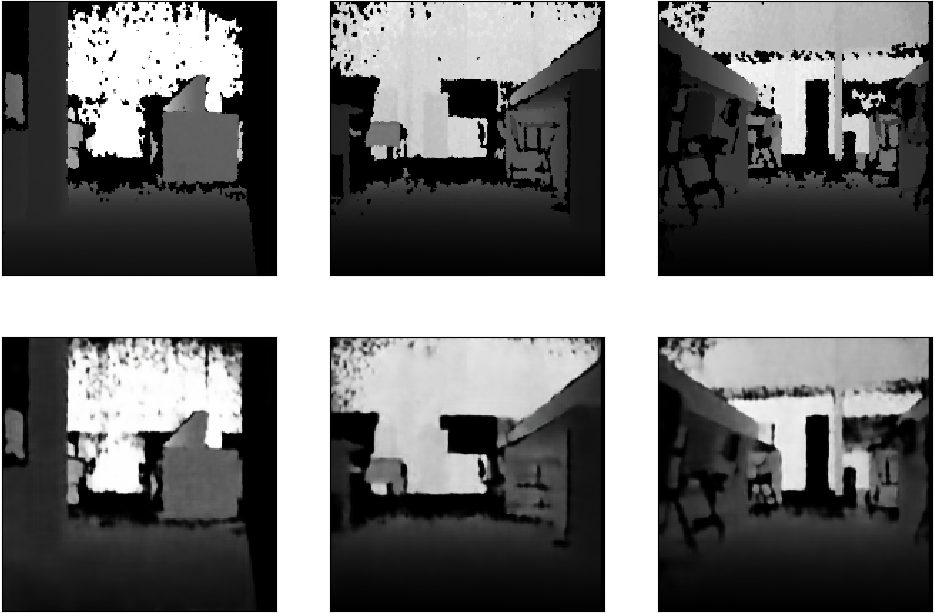
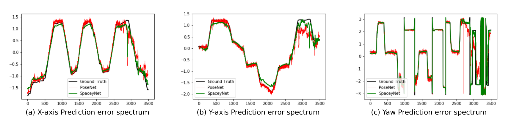

# SpaceYNet
> SpaceYNet: A Novel Approach to Pose and Depth-Scene Regression Simultaneously
* [IEEExplore](https://ieeexplore.ieee.org/document/9145427): Paper IEEExplore link.
* At *2020 International Conference on Systems, Signals and Image Processing (IWSSIP)*



## Stakeholder

| Role                 | Responsibility         | Full name                | e-mail       |
| -----                | ----------------       | -----------              | ---------    |
| Data Scientist       | Author                 | Dunfrey P. Aragão | dunfrey@gmail.com   |
| Advisor       | Advisor                 | Tiago Nascimento | tiagopn@ci.ufpb.br   |


#### Project Language

- Python 3
- [Tensorflow](https://www.tensorflow.org/)
- [Matplotlib](https://matplotlib.org/)
- [OpenCV](https://opencv.org/)
- [Scikit](https://scikit-learn.org/stable/)
- [Numpy](https://numpy.org/).


## Running

To run train project workflow, it is possible by the following command:

```
$ python main.py \
    train \
    --path_data_train ../dataset/laser/ \
    --output_path ../output/
```

#### Folder structure
>Explain you folder strucure
* **train**: SpaceYNet train method.
* **path_data_train**: training dataset to work on the training step.
* **output_path**: outcome from the classification model using validation data.

## Dataset

OuOur model achieves the following performance on the [LaSER](https://www.kaggle.com/dunfrey/laser-dataset) dataset

## Results

SpaceYNet is a multitasking model able to regress the robot's pose and the depth-scene image simultaneously.

We compared SpaceYNet to PoseNet - a state-of-the-art robot pose regression using CNN - to evaluate the pose outcomes.

The outcomes produced by the network and its comparison with PoseNet and ground-truth is displayed below:

> Depth-scene regression:

(At  the  top  are  the  reference values and the forecasts at the bottom)

&nbsp;
> 6-DoF pose regression:


## Citation

If you use SpaceYNet code in your research, we would appreciate a citation to the original paper:

    @INPROCEEDINGS{Aragao2020,
          author={Aragão, Dunfrey and Nascimento, Tiago and Mondini, Adriano},
          booktitle={2020 International Conference on Systems, Signals and Image Processing (IWSSIP)}, 
          title={SpaceYNet: A Novel Approach to Pose and Depth-Scene Regression Simultaneously}, 
          year={2020},
          volume={},
          number={},
          pages={217-222},
          doi={10.1109/IWSSIP48289.2020.9145427}}
